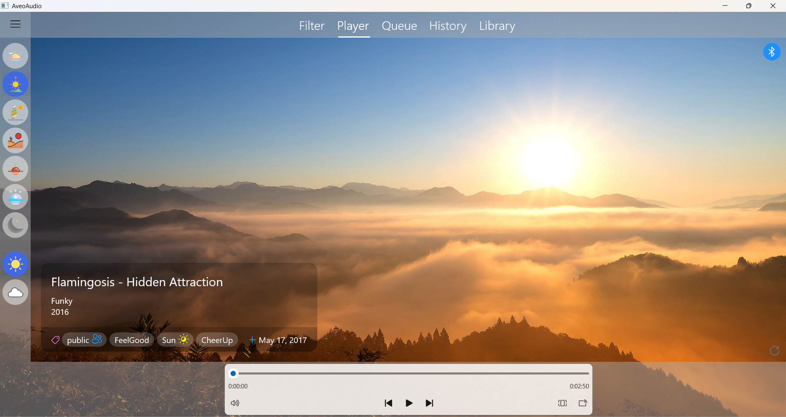
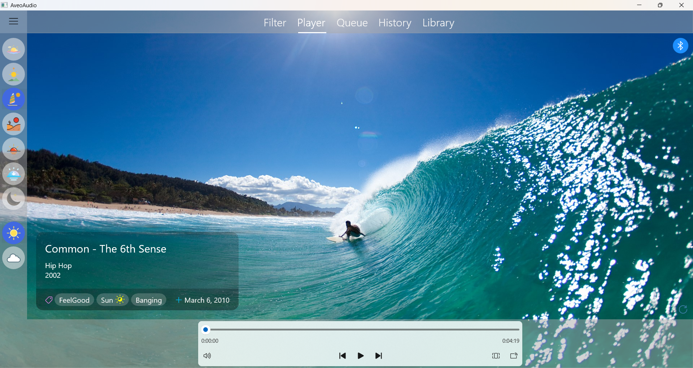
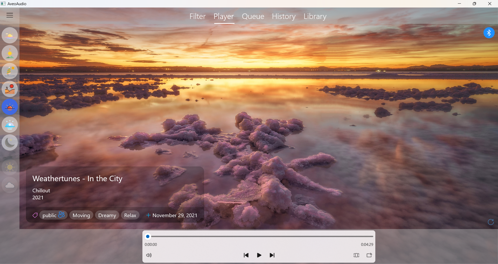
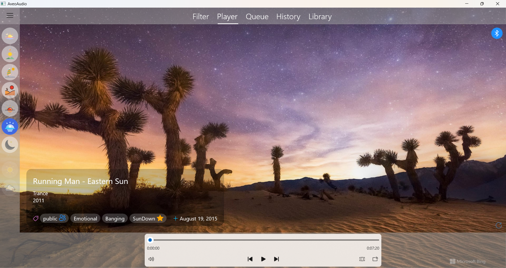
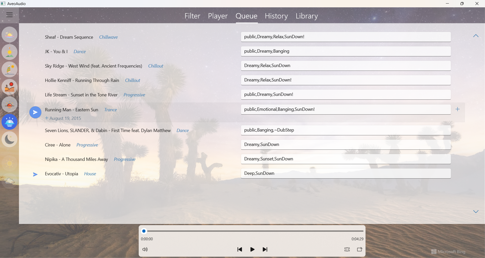

## AveoAudio

This is my personal project that I have been working on for quite a few years. It's a music player app that I originally built with UWP (Windows Universal) framework using Model-View-ViewModel (MVVM) pattern and later migrated to WinUI3/Windows App SDK which is currently the latest platform for building Windows apps.

I always use it for playing music on my Windows tablet whenever I'm driving somewhere in my car. Nothing in this life can make me feel the way music does. So, those are probably the best moments of my life.

